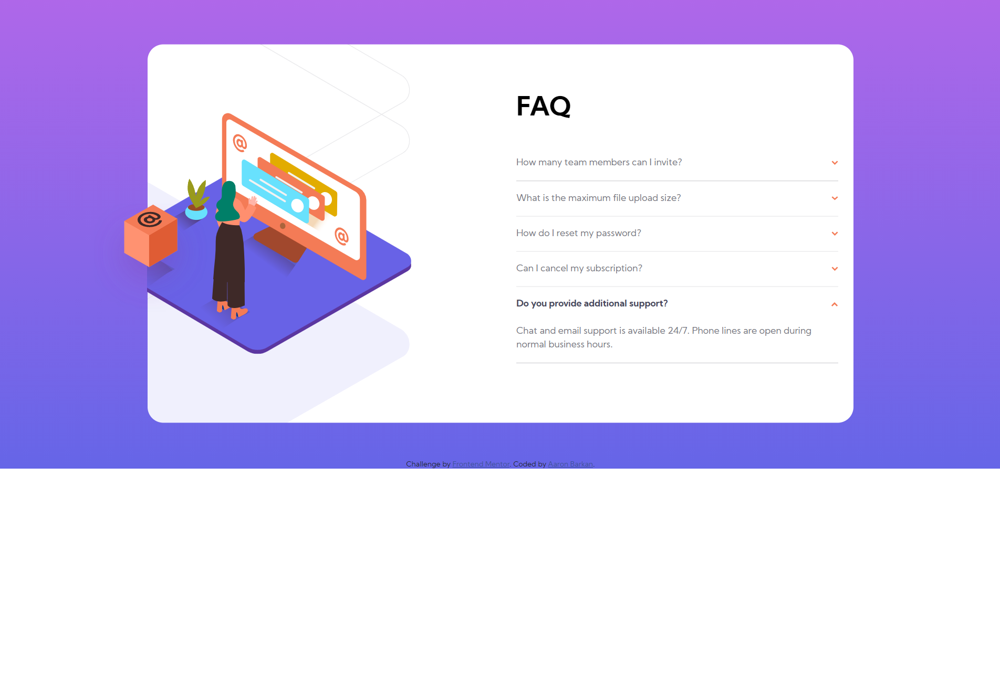

# Frontend Mentor - FAQ accordion card solution

This is a solution to the [FAQ accordion card challenge on Frontend Mentor](https://www.frontendmentor.io/challenges/faq-accordion-card-XlyjD0Oam). Frontend Mentor challenges help you improve your coding skills by building realistic projects.

## Table of contents

- [Overview](#overview)
  - [The challenge](#the-challenge)
  - [Screenshot](#screenshot)
  - [Links](#links)
- [My process](#my-process)
  - [Built with](#built-with)
  - [What I learned](#what-i-learned)
  - [Useful resources](#useful-resources)

## Overview

### The challenge

Users should be able to:

- View the optimal layout for the component depending on their device's screen size
- See hover states for all interactive elements on the page
- Hide/Show the answer to a question when the question is clicked

### Screenshot



### Links

- Live Site URL: [Add live site URL here](https://0rokusaki.github.io/faq-accordion-card/)

## My process

### Built with

- Semantic HTML5 markup
- CSS custom properties
- Bootstrap 5
- Mobile-first workflow
- jQuery

### What I learned

- In the CSS department, I learned how to implement .svg files as backgrounds, and how to manipulate them using custom CSS properties. See the code snippet below:

```css
.illustration-background {
  background-image:
    url("./images/illustration-woman-online-desktop.svg"),
    url("./images/bg-pattern-desktop.svg");
  background-position:
    -150% 50%,
    130% 60%;
  background-size:
    90%,
    185%;
  /* more code below... */
  }
```

- This is my first hands on with JS and jQuery. I learned much about Event Listeners and how to manipulate HTML elements with JS.

### Useful resources

- [Bootstrap 5 Documentation](https://getbootstrap.com/docs/5.0/getting-started/introduction/) - This helped me for mobile first-workflow.
- [jQuery Documentation](https://api.jquery.com/category/events/) - jQuery Documentation was helpful in understanding events and event listeners.
